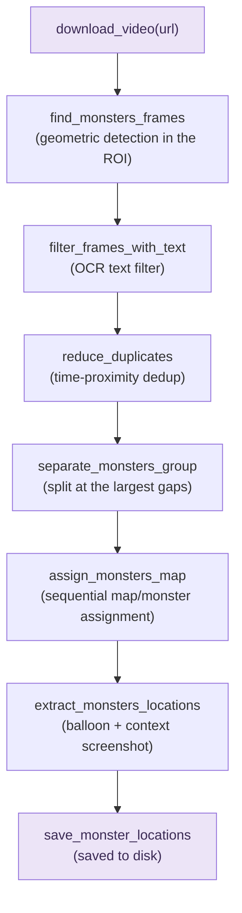
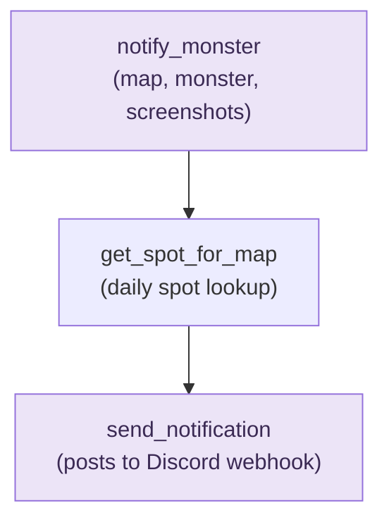

# 🐟 Creatures of the Deep: Monster Location Notifier

## Description

Python pipeline that detects the monster reveal moment on each of the
game's 8 maps from the daily video posted on Browind's YouTube channel,
and prepares ready-to-send screenshots plus map and monster
identification for a Discord notification to a game clan, without
anyone needing to watch the full video.

## Instructions

### Dependencies

- Python 3.14
- Homebrew packages: `tesseract`, `ffmpeg`

### Setup

```bash
python3.14 -m venv .venv
source .venv/bin/activate
pip install -r requirements.txt
brew install tesseract ffmpeg
cp .env.example .env
```

Fill in `DISCORD_WEBHOOK_URL` in `.env` with your webhook URL.

### Running

```bash
cd src
python3.14 main.py
```

## Project Structure

```
cotd_locations/
├── src/
│   ├── main.py            entry point: runs the full pipeline
│   ├── video_ops.py       download, scanning, dedup, map assignment
│   ├── image_ops.py       generic image ops (crop, contours, OCR)
│   ├── notifier.py        Discord webhook notification
│   ├── spot_table.py      daily spot lookup from community data
│   ├── sent_log.py        tracks which notifications were confirmed
│   │                      sent, to avoid duplicates on re-runs
│   ├── exceptions.py      pipeline-specific exception hierarchy
│   ├── data_types.py      shared type aliases
│   └── consts.py          calibration constants
│
├── tools/
│   ├── debug_roi.py       ROI/contour calibration helper
│   └── debug_video_info.py   inspects yt-dlp metadata without
│                              downloading the video
│
└── data/
    ├── spot_table.json    daily monster-spot codes shared by the
    │                      community
    └── sent_log.json      runtime state, not versioned (gitignored)
```

## Pipeline

### Detection & extraction



### Notification



Before calling `notify_monster` for each map, `main.py` checks
`sent_log.json` to skip notifications already confirmed as sent for
that date, and only records success after a real confirmation from
Discord — this keeps re-running the pipeline **idempotent**: safe to
retry without duplicating messages that already went through. A
network timeout that happens *after* Discord already received the
message is a known edge case that can still cause a duplicate, since
the client never gets that confirmation.

## Glossary

- **yt-dlp**: command-line tool (used here as a Python library) to
  download videos from YouTube; also used to fetch video metadata,
  like the upload date, without downloading the file
- **OCR (Optical Character Recognition)**: technology that reads text
  from images (used here via Tesseract, to read the balloon message)
- **ROI (Region of Interest)**: a fixed region of the screen where the
  search is restricted, to avoid false positives from unrelated areas
- **Geometric detection**: finding shapes in an image based on contour
  size and proportion, without relying on fixed pixel coordinates
- **Threshold (binary thresholding)**: converting a grayscale image
  into pure black-and-white, based on a brightness cutoff, to simplify
  shape detection
- **Deduplication**: removing repeated detections of the same
  real-world event, so only one representative screenshot per map is
  kept
- **Webhook**: a URL that lets an external app post directly into a
  specific Discord channel, without needing a full bot setup
- **Idempotency**: the property of an operation being safe to repeat
  without changing the outcome beyond the first successful run —
  here, re-running the pipeline for a date already fully notified
  produces no new messages

## Resources

- [OpenCV](https://opencv.org/): geometric detection, image processing
- [Tesseract](https://github.com/tesseract-ocr/tesseract) /
  [pytesseract](https://github.com/madmaze/pytesseract): OCR
- [yt-dlp](https://github.com/yt-dlp/yt-dlp): video download
- [ffmpeg](https://ffmpeg.org/): video and audio handling
- [httpx](https://www.python-httpx.org/): Discord webhook requests
- [python-dotenv](https://github.com/theskumar/python-dotenv): loads
  secrets (webhook URL) from a local `.env` file
- [loguru](https://github.com/Delgan/loguru): structured logging

## Status

- [x] Environment setup
- [x] Balloon detection (manual crop to geometric detection)
- [x] Video automation (download, OCR filter, deduplication)
- [x] Map/monster assignment by sequential order
- [ ] Refinements (nightly automation)
- [x] Discord integration (validated end-to-end with test server;
      swapping to the clan's real webhook)
- [ ] Automated test suite
